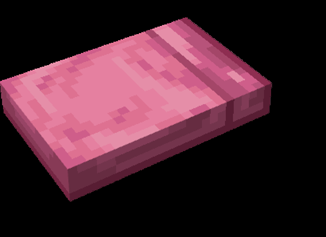

# HSV Mask Selection & Application Tools

## 功能概述

本项目提供一套完整的 HSV 掩膜调试与应用工具，用于图像颜色分割和目标检测研究流程，包括：

1. **精确 HSV 选择（Exact Tool）**
   支持多点点击选择图像颜色，自动计算选中点的最小和最大 HSV 值，不增加额外容差。适用于需要严格颜色阈值的场景。

2. **容差 HSV 选择（Estimating Tool）**
   支持多点点击选择图像颜色，自动计算 HSV 范围，并增加容差（Hue ±10, Saturation ±40, Value ±40），适用于颜色存在一定变化或光照不均的场景；
   对于大块类似颜色，可减少点击次数；同时对于难以点击的细节线条起到包容作用。

4. **掩膜生成与结果保存示例**
   使用计算出的 HSV 范围生成掩膜，提取选中颜色区域，并保存处理后的图像，便于后续分析或实验验证。

---

## 安装依赖

```bash
pip install opencv-python numpy
```

---

## 工具使用方法

### 1️. 精确 HSV 掩膜调试工具（Exact Mode）

```python
from T1.HSV_exact import hsv_mask_exact_tool

# 输入图像路径
image_path = "img1.png"

# 调用 Exact 工具
lower_hsv, upper_hsv = hsv_mask_exact_tool(image_path)

print("精确 HSV 下限:", lower_hsv)
print("精确 HSV 上限:", upper_hsv)
```

特点：

* 不增加额外容差，适合对颜色要求严格的场景。
* 点击点会在图像显示红色圆点，实时展示掩膜覆盖效果。

#### GIF 演示


---

### 2️. 容差 HSV 掩膜调试工具（Estimating Mode）

```python
from T1.HSV_estimate import hsv_mask_estimating_tool

# 输入图像路径
image_path = "img1.png"

# 调用 Estimating 工具
lower_hsv, upper_hsv = hsv_mask_estimating_tool(image_path)

print("容差 HSV 下限:", lower_hsv)
print("容差 HSV 上限:", upper_hsv)
```

特点：

* 在计算出的 HSV 范围基础上增加容差（默认 H±10, S±40, V±40）。
* 适合颜色存在一定光照变化的目标。
* 实时显示红色掩膜覆盖效果，帮助调试。

#### GIF 演示


---

### 3️. 掩膜生成与结果保存示例

```python
import cv2
import numpy as np
from datetime import datetime
from T1.HSV_estimate import hsv_mask_estimating_tool

# 读取图像
img = cv2.imread("img1.png")
hsv = cv2.cvtColor(img, cv2.COLOR_BGR2HSV)

# 获取 HSV 范围
lower, upper = hsv_mask_estimating_tool("img1.png")

if lower is None or upper is None:
    print("未选择颜色点，无法生成掩膜")
else:
    lower = np.array(lower, dtype=np.uint8)
    upper = np.array(upper, dtype=np.uint8)

    # 生成掩膜
    mask = cv2.inRange(hsv, lower, upper)
    result = cv2.bitwise_and(img, img, mask=mask)

    # 保存结果
    timestamp = datetime.now().strftime("%Y%m%d_%H%M%S")
    out_filename = f"img1_out_{timestamp}.png"
    cv2.imwrite(out_filename, result)
    print(f"掩膜图保存成功：{out_filename}")
```

特点：

* 使用计算出的 HSV 范围生成掩膜。
* 保存处理后的图像，便于实验记录和后续分析。

---

## 整体研究流程示意

1. **图像准备**：选定待处理图像。
2. **HSV 掩膜调试**：

   * 使用 **Exact Tool** 获取精确 HSV 范围（严格模式）。
   * 或使用 **Estimating Tool** 获取带容差 HSV 范围（宽松模式）。
3. **掩膜生成**：将 HSV 范围应用到图像，提取目标颜色区域。
4. **结果保存**：生成的掩膜图像保存为 PNG 文件，可用于后续分析或可视化验证。

### 结果示例效果

#### 精确静态截图


#### 容差静态截图




> 由图可知，对于选取的图片，使用容差方法能够获得更优的 HSV 匹配效果。
> 相较于精确选点方法，容差调整能够提升掩膜选择的稳定性与覆盖度。

---

## 两个工具的主要代码差异

| 工具 | 容差处理 | 适用场景 | 说明 |
|------|-----------|-----------|------|
| `HSV_exact` | 无容差 | 颜色严格要求的场景 | 直接使用点击点的最小/最大 HSV 值生成掩膜 |
| `HSV_estimate` | H±10, S±40, V±40 | 颜色存在光照变化或细节难选的场景 | 自动在 HSV 范围上增加容差，提高掩膜稳定性和覆盖度 |

### 核心代码对比

#### HSV_exact 核心代码

```python
# Exact 不增加容差
lower_hsv = hsv_array.min(axis=0)
upper_hsv = hsv_array.max(axis=0)
mask = cv2.inRange(img_hsv, lower_hsv, upper_hsv)
```

#### HSV_estimate 核心代码
```python
# Estimating 增加容差
tol = np.array([10, 40, 40])
lower_hsv = np.clip(hsv_array.min(axis=0) - tol, 0, [179, 255, 255])
upper_hsv = np.clip(hsv_array.max(axis=0) + tol, 0, [179, 255, 255])
mask = cv2.inRange(img_hsv, lower_hsv, upper_hsv)
```
### 关键差异点：

* HSV_estimate 在返回 HSV 范围时会增加预设容差，HSV_exact 不增加。

* 其他流程完全一致：多点点击选择颜色 → 显示红色圆点 → 实时显示掩膜覆盖 → 返回 HSV 范围。

---

## 返回值说明

* `lower_hsv` / `upper_hsv`：HSV 范围 `[H, S, V]`，Estimating 模式包含容差。
* 如果未点击任何点，返回 `(None, None)`。

---

## 容差说明（Estimating Tool）

* Hue 容差：±10
* Saturation 容差：±40
* Value 容差：±40
* 可在代码中修改 tol 数组自定义容差。
  
---

