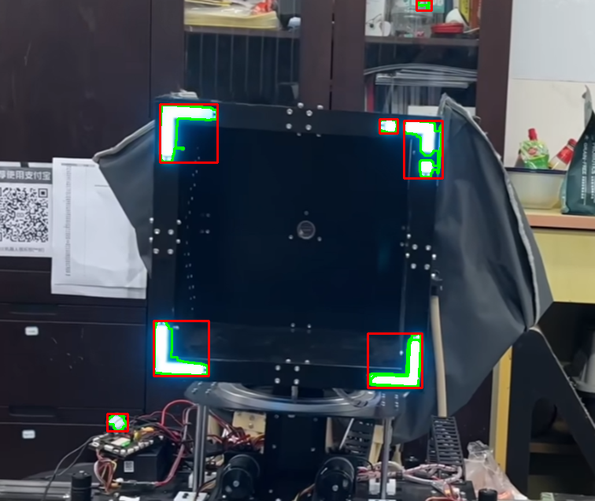
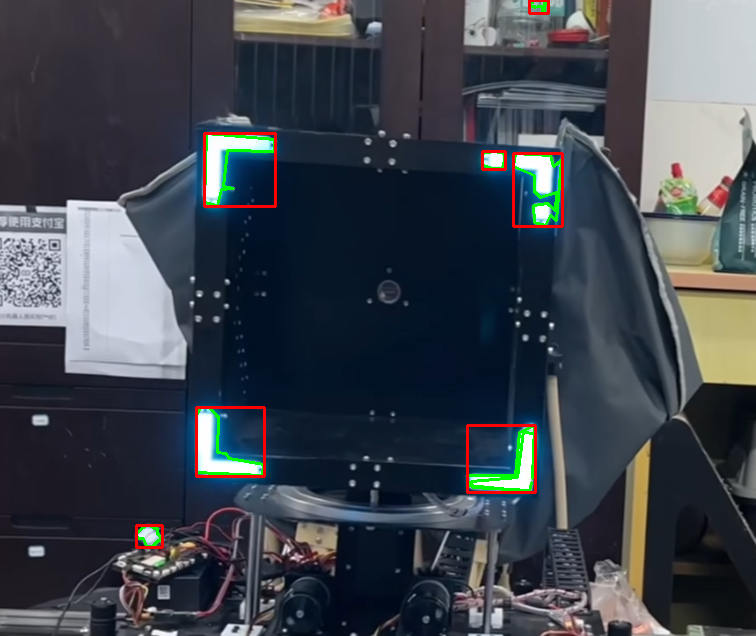
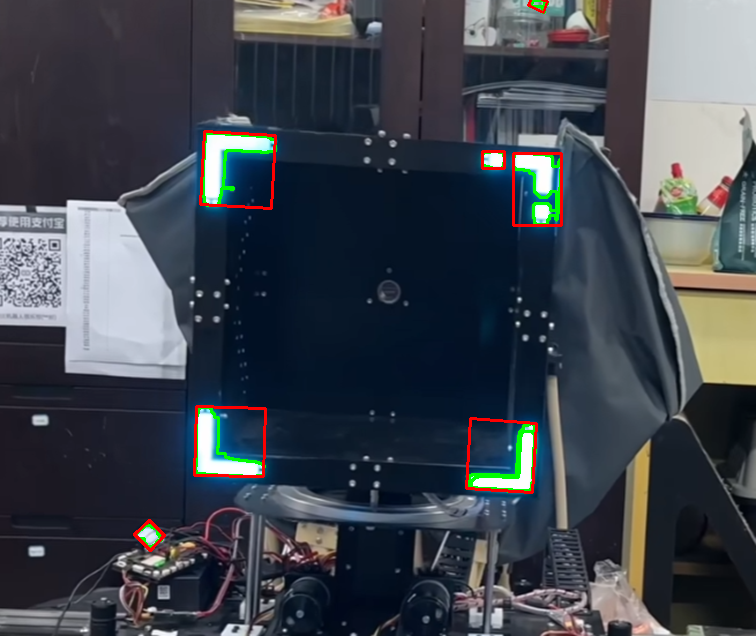

# 蓝色箭头灯条目标检测项目

## 一、项目目标
本项目旨在实现对图像中蓝色箭头灯条的自动检测与框选。通过颜色分割、形态学处理和轮廓分析，实现目标的可视化标注，并保存检测结果。

---

## 二、检测方法概览
项目共包含三种检测策略，对应三个版本代码：

| 版本 | 方法 | 特点 | 优化点 |
|------|------|------|------|
| v1 | 直接使用 `boundingRect` | 对每个轮廓生成水平矩形 | 速度快，代码简洁，但对斜放箭头框不准 |
| v2 | `approxPolyDP` 多边形近似 + `boundingRect` | 使用多边形拟合轮廓，再生成矩形 | 对不规则轮廓更精确，减少过度框选，但略慢 |
| v3 | `minAreaRect` 最小旋转矩形 | 生成旋转矩形框，可匹配任意角度 | 对斜放箭头检测准确，结果更紧凑，适合多方向目标 |

---

## 下面是待检测的蓝色箭头灯条原图：


---

## v1 检测结果 - 水平矩形框（Bounding Rect）

v1 版本使用 `boundingRect` 方法生成水平矩形框，速度快，但对斜放箭头框可能不准。



>可见有拟合良好的绿色轮廓线和水平红色框选


---

## v2 检测结果 - 多边形近似 + 矩形框

v2 版本先用 `approxPolyDP` 对轮廓做多边形近似，再生成矩形框。  
对不规则轮廓更精确，但速度略慢。


>可见误差较大的绿色轮廓线和水平红色框选

此时通过调节误差大小可得拟合更好的轮廓线
```python
epsilon = 0.01 * cv2.arcLength(cnt, True)  # 改小一点
approx = cv2.approxPolyDP(cnt, epsilon, True)
cv2.drawContours(result_img, [approx], -1, (0, 255, 0), 2)
```



---

## v3 检测结果 - 最小旋转矩形

v3 版本使用 `minAreaRect` 最小旋转矩形，可匹配任意角度的箭头灯条。  
这是最精确的版本，适合复杂场景。



>可见拟合良好和具有旋转角度的红色框选

---

## 三、共通处理流程
1. **读取图像**  
```python
img = cv2.imread(img_path)
hsv = cv2.cvtColor(img, cv2.COLOR_BGR2HSV)
```

2. **蓝色颜色分割**
```python
lower_blue = np.array([90, 30, 180], dtype=np.uint8)
upper_blue = np.array([140, 255, 255], dtype=np.uint8)
mask = cv2.inRange(hsv, lower_blue, upper_blue)
```

3. **形态学闭操作**
```python
kernel = cv2.getStructuringElement(cv2.MORPH_RECT, (3,3))
mask = cv2.morphologyEx(mask, cv2.MORPH_CLOSE, kernel, iterations=2)
```

4. **轮廓检测**
```python
contours, _ = cv2.findContours(mask, cv2.RETR_EXTERNAL, cv2.CHAIN_APPROX_SIMPLE)
```

5. **目标筛选与绘制**

* 过滤小面积区域

* 根据版本不同生成矩形或多边形框

* 绘制在原图上并保存

---

## 四、版本核心代码示例
### v1 - 原始轮廓 + 水平矩形框（Bounding Rect）
```python
for cnt in contours:
    if cv2.contourArea(cnt) < 80:
        continue
    x, y, w, h = cv2.boundingRect(cnt)
    if w < 5 or h < 5:
        continue
    cv2.rectangle(result_img, (x, y), (x+w, y+h), (0,0,255), 2)
```

### v2 - 多边形近似 + 水平矩形框
```python
epsilon = 0.03 * cv2.arcLength(cnt, True)
approx = cv2.approxPolyDP(cnt, epsilon, True)
x, y, w, h = cv2.boundingRect(approx)
cv2.rectangle(result_img, (x, y), (x+w, y+h), (0,0,255), 2)
```

### v3 - 原始轮廓 + 最小旋转矩形
```python
rect = cv2.minAreaRect(cnt)
(x, y), (w, h), angle = rect
if w < 5 or h < 5:
    continue
box = cv2.boxPoints(rect)
box = box.astype(np.int32)
cv2.drawContours(result_img, [box], 0, (0,0,255), 2)
```
## 使用示例
```python
from detect_blue_light_arrow_v3 import detect_blue_light_arrow

mask, result_img, results = detect_blue_light_arrow("img2.png")
```
* 输出结果为：
  - mask：二值掩膜
  - result_img：带矩形或多边形标注的图像
  - results：检测到的箭头区域信息

---

## 五、优化点总结

* 1.颜色分割优化
  - HSV阈值可通过可视化工具调整，以覆盖不同亮度和环境光条件。

* 2.噪声过滤
  - 使用面积过滤和形态学闭操作，可减少小杂点干扰。

* 3.框选方式优化
  - v3 的最小旋转矩形可准确匹配斜向目标，适合复杂场景。

* 4.结果可视化与保存
  - 文件命名加时间戳，避免覆盖，并便于批量处理。

---


## 六、即使已经能描出完整轮廓线，还要做多边形拟合（approxPolyDP）

### 1）背景：`findContours` 已能描出完整轮廓

`cv2.findContours()` 返回的轮廓确实是非常密集、细致的边界点集，可以完整描出目标形状。  
但这条轮廓线通常包含上百甚至上千个点，如下结构：

[(x1, y1), (x2, y2), (x3, y3), ..., (xn, yn)]


这种表示方式虽然形状精确，但：

- 数据量大；  
- 不利于后续几何分析（例如判断箭头形状、角度、方向）；  
- 不便于计算包围框或拟合模型。  

---

### 2)作用：`approxPolyDP` 多边形拟合的意义

`cv2.approxPolyDP(contour, epsilon, True)` 是一种多边形近似算法（Douglas–Peucker算法），它通过一个容差参数 `epsilon`，对轮廓点进行**几何简化和平滑**。

#### 优点如下：

| 功能点 | 说明 |
|--------|------|
| 1️⃣ 降噪简化 | 去除细碎边界波动（如检测到的锯齿、抖动），轮廓更平滑。 |
| 2️⃣ 特征提取方便 | 简化后往往得到规则形状（如箭头可简化为5边形、矩形等）。 |
| 3️⃣ 提高计算效率 | 简化后的点数更少，计算角点、面积或方向更快。 |
| 4️⃣ 形状识别基础 | 可用于判断形状种类（如三角形、矩形、箭头等）。 |

---

### 3）直观对比

| 类型 | 轮廓点数 | 可读性 | 用途 |
|------|-----------|--------|------|
| `findContours` 原始轮廓 | 300–1000个点 | 非常细碎 | 仅用于可视化显示 |
| `approxPolyDP` 拟合后 | 4–10个关键点 | 结构清晰 | 可用于判断方向、形状分析 |

---

### 4）在本项目中的意义（箭头灯条检测）

在箭头灯条检测任务中，多边形拟合的实际作用如下：

1. **消除边缘抖动**  
   箭头的边缘通常处于亮度突变区域，原始轮廓易出现锯齿和不连续点；  
   多边形拟合后边界更平滑，轮廓结构更稳定。  

2. **形状简化与提取**  
   通过 `approxPolyDP`，箭头边缘被简化为几个关键直线面，便于判断方向与几何特征。  

3. **提高框选精度**  
   使用 `cv2.boundingRect(approx)` 或 `cv2.minAreaRect(approx)` 能获得更紧凑、方向更准确的包围框。  

---

### 5）总结

多边形拟合不仅是视觉平滑优化，更是**结构化形状分析的前置步骤**。  
在箭头检测中，它让结果更加：
- 平滑；
- 规则；
- 稳定；
- 易于后续几何判断与目标分析。
* 输出结果为：
  - mask：二值掩膜
  - result_img：带矩形或多边形标注的图像
  - results：检测到的箭头区域信息
