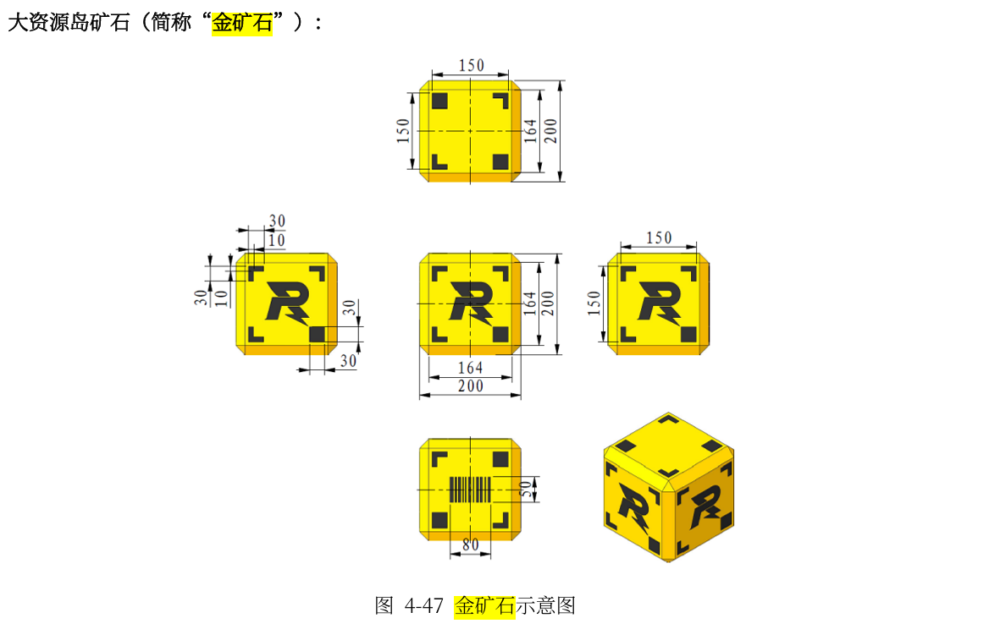
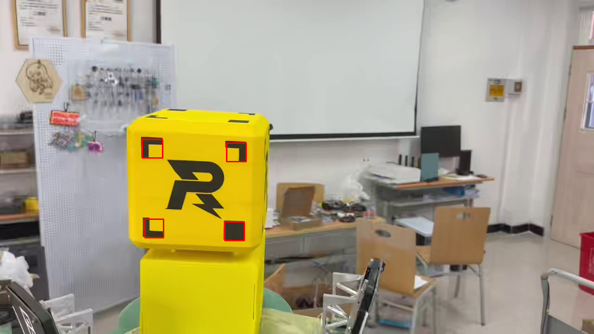

#  Black Shape 3D Pose Detection System

## 本项目基于 **OpenCV + Python**，实现了从视频或摄像头画面中检测黄色背景上的黑色方块，并通过 `solvePnP` 计算物体的三维位姿，在画面中实时绘制 3D 坐标轴。

## 目标

> 注意此文件中的HSV分割范围由T1中的exact tool函数提取
> 

---

## 主要功能

* 黄色背景区域检测与黑色形状提取
* 方块跳动过滤与面积稳定性判断
* 四角自动排序与对应 3D 坐标映射
* `solvePnP` 求解位姿并绘制 3D 坐标轴
* 视频帧保存、结果视频输出与演示 GIF（可选）

---

## 文件结构

```
project_root/
├── camera.py                        # 摄像头拍照脚本（按空格拍照，ESC退出）
├── imagepoints.py                   # 目标框选与过滤函数模块、排序获得指定2d坐标角点
├── pnp.py                           # 🎯 主程序：位姿检测与可视化（核心文件）
├── stone.mp4                        # 测试视频（可替换）
├── demo.gif                         # （可选）演示 GIF，用于 README 预览
└── README.md                        # 本文件
```

---

## ⚙️ 依赖与安装

建议 Python 3.8+。

```bash
pip install opencv-python numpy imageio
```
---

## 文件说明

---

### 1. `camera_capture.py`

* 功能：打开默认摄像头，按 **空格** 保存当前帧（带时间戳），按 **ESC** 退出。

---

### 2. `imagepoints.py`

* 功能：实现 `detect_black_shapes_on_yellow()`、`sort_squares_corners()`、`filter_jumping_squares()`。
* 已修正与说明：

  * `detect_black_shapes_on_yellow()` 支持输入为图片路径或 ndarray，并返回 `(result_img, squares)`。
  * 面积差异判断：当 `len(squares) == 4` 时，若 `(max_area - min_area) / max_area > area_diff_ratio` 则认为差异过大并丢弃（README 中推荐把阈值命名为 `area_diff_ratio` 并用相对最大面积判断）。
  * 跳动过滤：提供两种可选逻辑（按索引逐一比较或按最近距离匹配），默认代码示例使用按索引比较（当保证排序稳定时）。

* 框选目标，可用于检测角点是否可以准确输出
  * 

---

### 3. `pose_estimation.py`（主程序 — **重点**）

功能概览：

* 从视频或摄像头读取帧
* 调用 `detect_black_shapes_on_yellow()` 检测四个角点
* 构造 `imagePoints`（**注意：使用矩形的合适角点位置**）并与 `objectPoints` 对应
* 使用 `cv2.solvePnP()` 求解 rvec/tvec
* 使用 `cv2.drawFrameAxes()` 绘制 3D 坐标轴到图像
* 将可视化帧写入输出视频 `output_result.mp4`

关键参数（请根据你的相机标定结果调整）：

```python
cameraMatrix = np.array([[fx, 0, cx],
                         [0, fy, cy],
                         [0, 0, 1]], dtype=np.float32)
distCoeffs = np.array([k1, k2, p1, p2, k3], dtype=np.float32)

objectPoints = np.array([
    [-w/2, -h/2, 0],  # 左上（世界坐标示例）
    [-w/2,  h/2, 0],  # 左下
    [ w/2, -h/2, 0],  # 右上
    [ w/2,  h/2, 0],  # 右下
], dtype=np.float32)

axis_length = 50
jump_threshold = 40
```

运行示例：

```bash
python pose_estimation.py
```

按键说明：

* `Space`：暂停 / 继续
* `S`：保存当前帧为图片（文件名 `saved_frame_<tick>.png`）
* `ESC`：退出

输出文件：

* `first_frame_detected.png`（首次检测到四个角点时保存）
* `output_result.mp4`（带坐标轴的输出视频）

---

## GIF 演示
### 坐标绘制效果

* 同时程序自动保存一帧框选图，判断角点是否符合
### 视频帧框选效果


---
## ⚖️ 参数调节说明

| 参数 | 含义 | 推荐值 | 说明 |
|:--|:--|:--|:--|
| `jump_threshold` | 单帧跳动距离阈值 | 40~60 | 单位为像素，值越小越严格 |
| `area_diff_ratio` | 面积差异比例阈值 | 0.3 | 方块面积波动超过该比例则丢弃 |
| `axis_length` | 坐标轴长度 | 50 | 控制绘制轴的长度 |


